# Assignment 3 — Production Maintenance Drill (OPS Checklist)

Part of the DevOps Micro Internship (DMI) Cohort 3 with Agentic AI

---

## Purpose

In this assignment, you will treat your already deployed React application (on Ubuntu VM with Nginx) as a live production system. You will perform structured operational checks covering network validation, service health, log analysis, resource monitoring, configuration verification, and incident simulation with recovery — mirroring real on-call DevOps responsibilities.

---

# Task 1 — Server Access & Networking Validation

## Goal

Verify that the deployed React application is reachable from the browser and confirm basic network connectivity of the Ubuntu VM.

### Evidence

#### Screenshot 1 — Browser showing the React app with your Full Name visible on the UI

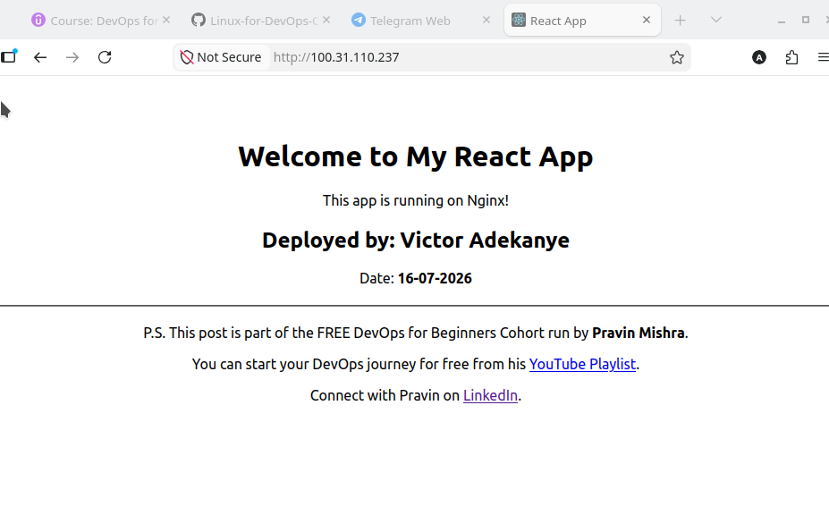

---

#### Screenshot 2 — Output of `ip a`

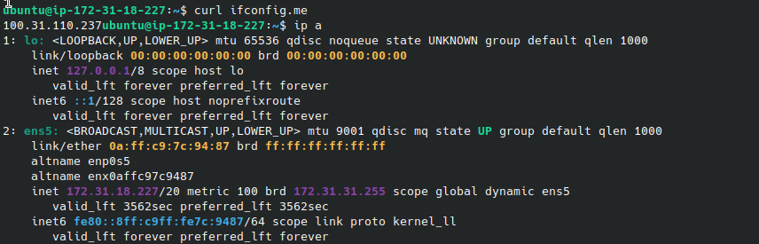

---

#### Screenshot 3 — Output of `sudo ss -tulpen`
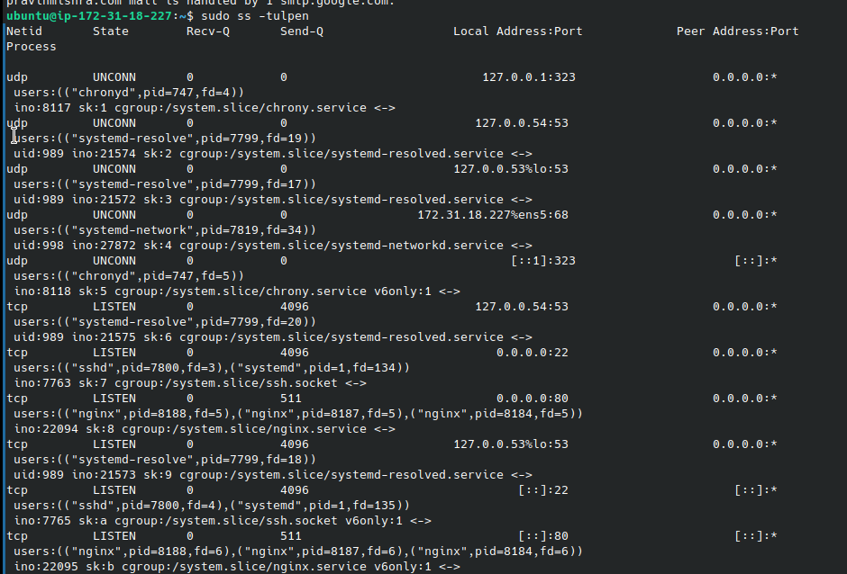

---

#### Screenshot 4 — Output of `sudo ufw status`

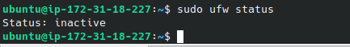

---

### Notes

Answer the following in your own words:

**1. What proves Nginx is listening on 0.0.0.0:80?**

What shows that nginx is listening on 0.0.0.0:80 is after running the command sudo ss -tulpen i was able to see Listen 0 511 0.0.0.82

---

**2. What proves SSH is active on port 22?**

Also the output displays the line tcp  LISTEN 0 4096 0.0.0.0:22 showing (sshd which is the ssh daemon actively listening on that port)

---

**3. Did you find any unexpected open ports? Explain briefly.**

From all open ports the open ones are the crucial ones such as Port 53 for DNS , port 323 for time styncing and port 68 for dhcp [ all these are expected ports to be open] so there was no unexpected open ports 

---

# Task 2 — Service Health & Systemd Validation (Nginx)

## Goal

Verify that Nginx is properly installed, running, enabled at boot, and safely configured.

### Evidence

#### Screenshot 1 — Output of `systemctl status nginx --no-pager`

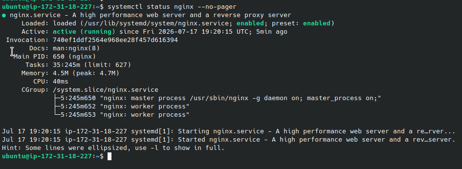

---

#### Screenshot 2 — Output of `sudo nginx -t`

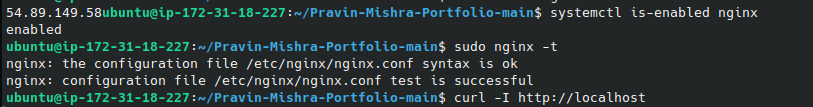

---

#### Screenshot 3 — Output of `sudo ss -lptn '( sport = :80 )'`

---

### Notes

Answer the following in your own words:

**1. What happens if Nginx fails to restart in production?**

If Nginx fails to restart in a live production environment, it triggers an immediate critical service outage.

---

**2. What's your basic rollback plan?**

A reliable rollback plan ensures you can restore the website to its last known working state within seconds of a failed restart.

Restore the Previous Configuration
Verify Configuration Integrity
Force a Safe Restart
Confirm Live Status
---

# Task 3 — Logs & Request Trace

## Goal

Verify real traffic flow and analyze logs to understand system behavior and errors.

### Evidence

#### Screenshot 1 — Output of `sudo tail -n 30 /var/log/nginx/access.log`

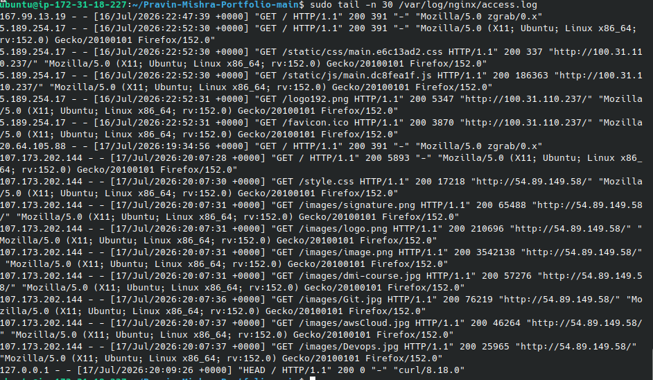
---

#### Screenshot 2 — Output of `sudo tail -n 30 /var/log/nginx/error.log`

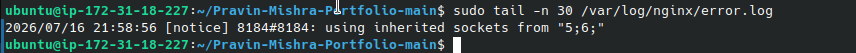

---

#### Screenshot 3 — Output of `sudo journalctl -u nginx --no-pager -n 50`

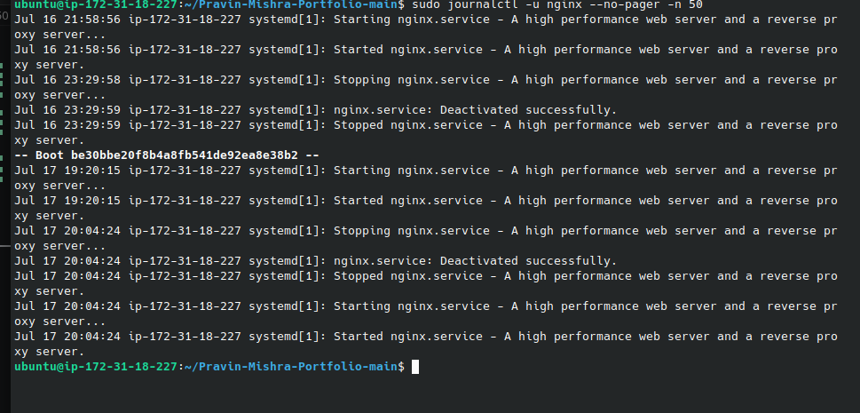

---

### Notes

Answer the following in your own words:

**1. Were there any errors in the logs?**

- If yes, mention 1–2 example error lines from the logs and explain what each one means in simple terms.
- If no, explain what it means if the error log is empty or shows no recent errors during your check.

Write your answer here.

No, there were no errors in the logs.The system logs (journalctl) show that Nginx started, stopped, and restarted cleanly with messages like "deactivated successfully." The snippet of the access log also shows status codes of 200, which means those requests completed successfully.

**2. If there were no errors, what does that indicate about the system?**

The absence of errors indicates that the core web server infrastructure is completely healthy
---

**3. Based on the access logs, were your curl requests visible in the log entries? What does that prove about traffic flow?**

No, the curl requests were not visible in the provided log snippet. Instead, the logs captured traffic from an automated network scanner ("zgrab") and a standard web browser ("firefox/152.0").

---

# Task 4 — System Resource Health Check (Capacity Red Flags)

## Goal

Assess server capacity and detect potential performance or failure risks.

### Evidence

#### Screenshot 1 — Output of `uptime`

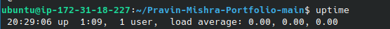

---

#### Screenshot 2 — Output of `free -h`

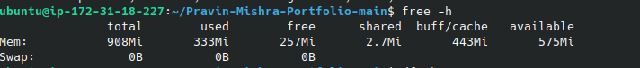

---

#### Screenshot 3 — Output of `df -h`

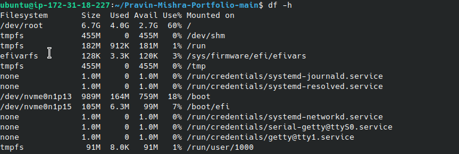

---

#### Screenshot 4 — Output of `sudo du -sh /var/* | sort -h`

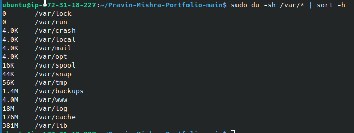
---

### Notes

Answer the following in your own words:

**1. Which resource looks most critical right now? (CPU/load, memory, or disk) Explain why.**

Memory (RAM) is the most critical resource right now.

---

**2. What happens if disk becomes 100% full in a production server?**

When a live production server runs entirely out of disk space, it triggers an immediate system-wide operational failure.

---

# Task 5 — Configuration & Deployment Verification

## Goal

Ensure the correct React build is deployed and Nginx is serving it properly.

### Evidence

#### Screenshot 1 — Output of `ls -lah /var/www/html | head -n 20`

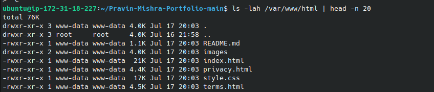

---

#### Screenshot 2 — Output of `grep -R "Deployed by" -n /var/www/html 2>/dev/null | head`

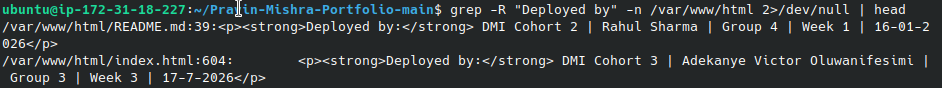

---

#### Screenshot 3 — Output of `grep -n "try_files" /etc/nginx/sites-available/default`

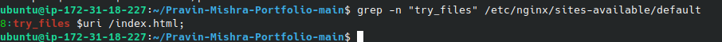

---

### Notes

Answer the following in your own words:

**1. How do you confirm that the correct version of the application is deployed?**
Based on the terminal output, the grep command to search for specific deployment indicators like "Deployed by" inside the public web folder (/var/www/html).Verified the Output: The search results show the file path and line number containing the deployment details:

---

# Task 6 — Nginx Configuration Failure Simulation

## Goal

Simulate a real-world Nginx misconfiguration and recover the service safely.

### Evidence

#### Screenshot 1 — Output of `sudo nginx -t` showing the syntax error (broken config)

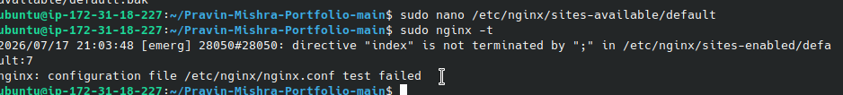

---

#### Screenshot 2 — Output of `sudo nginx -t` showing syntax ok (fixed config)

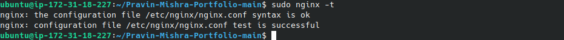

---

#### Screenshot 3 — Output of `curl -I http://<public-ip>` confirming recovery (200 OK)

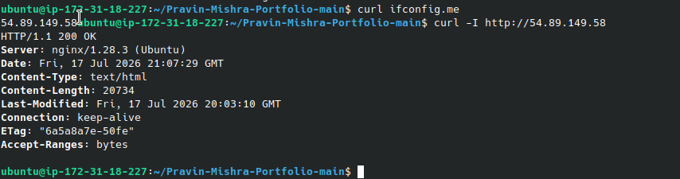

---

### Notes

Answer the following in your own words:

**1. What caused the configuration failure?**

The configuration failure was caused by a deliberate syntax error introduced into the Nginx configuration file. Specifically, a vital structural element—such as a closing semicolon (;) at the end of a statement

---

**2. How did you fix the issue?**

Restoring from Backup: The corrupted configuration file was overwritten by copying the clean, functional backup file (default.bak) that was created before the simulation started.

---

**3. How can you avoid this kind of issue in real production systems?**
Always run syntax tests: Never restart or reload Nginx without running sudo nginx -t first. If the test fails, do not apply the changes.

Use zero-downtime reloads: Instead of running a hard restart (which drops active connections),
 use sudo systemctl reload nginx. A reload reads the new configuration silently in the background; if the file is broken, it safely leaves the old configuration running without interrupting users.
 Also make sure one backs up
---

# Task 7 — Web Application Failure Simulation

## Goal

Simulate missing deployment content and recover the application safely.

### Evidence

#### Screenshot 1 — Output of `curl -I http://<public-ip>` showing failure (non-200 response)

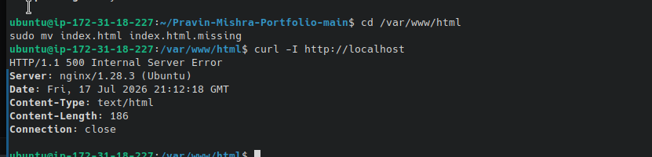

---

#### Screenshot 2 — Output of `curl -I http://<public-ip>` confirming recovery (200 OK)

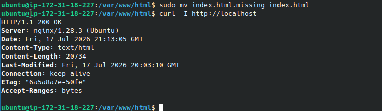

---

### Notes

Answer the following in your own words:

**1. What caused the application to break in this scenario?**

The application broke because its primary entry point file (index.html) went missing from the designated web root directory (/var/www/html). In this simulation, the file was intentionally renamed to index.html.missing. 

---

**2. How did you fix the issue and restore the application?**

Renaming the File: The command sudo mv index.html.missing index.html was executed to instantly change the file name back to what Nginx expects.
---

**3. What steps would you take to prevent this kind of issue in real production systems?**

Deploy Using Atomic Symlinks
Implement a Custom 404 Fallback

---

# Task 8 — Security & Reliability Review

## Goal

Review and reflect on the security and reliability practices applied during this assignment.

### Security & Reliability Notes

Answer the following in your own words:

**1. Why is SSH key-based authentication more secure than sharing passwords?**

Passwords can eventually be guessed or cracked using high-speed automated dictionaries. SSH keys use complex cryptographic pairs (a public and private key) that are mathematically impossible to guess or brute-force.

---

**2. Why should only required ports be open on a production server?**

Keeping only necessary ports open minimizes the server's "attack surface," which is the total number of entry points an attacker can exploit

---

**3. Why is it important for Nginx to be enabled on boot?**

Enabling Nginx to start automatically on system boot ensures high availability and automated recovery for your web application

---

**4. What are the risks of sharing secrets, keys, or credentials publicly?**

Instant Automated Exploitation
System Hijacking

---

**5. Why should cloud resources be stopped or terminated when they are no longer needed?**

The main reasons to clean up resources are:   Cost Control, Eliminating Forgottten Vulnerabilities

---

# LinkedIn Post (Required)

## Evidence

#### LinkedIn Post URL

Paste your LinkedIn post URL here:

`Add your URL here`

---

#### Screenshot — Published LinkedIn post

Add your screenshot here.

---

# Submission Instructions

- Add all required screenshots in your submission
- Full name must be visible in required screenshots
- Do not expose sensitive information (keys, passwords, account IDs)

---

# Completion Checklist

- [x] Task 1: Screenshots (browser, ip a, ss -tulpen, ufw status) + Notes answered
- [x] Task 2: Screenshots (nginx status, nginx -t, ss port 80) + Notes answered
- [x] Task 3: Screenshots (access log, error log, journalctl) + Notes answered
- [x] Task 4: Screenshots (uptime, free -h, df -h, du -sh) + Notes answered
- [x] Task 5: Screenshots (ls html, grep deployed by, grep try_files) + Notes answered
- [x] Task 6: Screenshots (nginx -t fail, nginx -t pass, curl recovery) + Notes answered
- [x] Task 7: Screenshots (curl failure, curl recovery) + Notes answered
- [x] Task 8: Security & Reliability Notes answered
- [x] LinkedIn post published and URL submitted
- [x] Full Name visible in all required screenshots
- [x] No sensitive data exposed

---

## 📌 About DMI & CloudAdvisory

DevOps Micro Internship (DMI) is a project-based DevOps program run by Pravin Mishra (The CloudAdvisory) focused on real-world execution, systems thinking, and career readiness.

It helps learners build strong DevOps foundations with hands-on experience.

---

## 📌 Resources

- 🌐 DMI Official Website: https://pravinmishra.com/dmi  
- 🎓 DevOps for Beginners (Udemy): https://www.udemy.com/course/devops-for-beginners-docker-k8s-cloud-cicd-4-projects/  
- 🎓 Agentic AI DevOps with Claude Code: https://www.udemy.com/course/ultimate-agentic-ai-devops-with-claude-code/  
- 🎓 DevOps with Claude Code: Terraform, EKS, ArgoCD & Helm: https://www.udemy.com/course/devops-with-claude-code-terraform-eks-argocd-helm/  
- ▶️ YouTube Playlist: https://www.youtube.com/playlist?list=PLFeSNDtI4Cho  
- 🔗 Pravin Mishra (LinkedIn): https://www.linkedin.com/in/pravin-mishra-aws-trainer/  
- 🏢 CloudAdvisory (LinkedIn): https://www.linkedin.com/company/thecloudadvisory/

---

*This submission is part of DevOps Micro Internship (DMI) Cohort 3 — Agentic AI Track.*